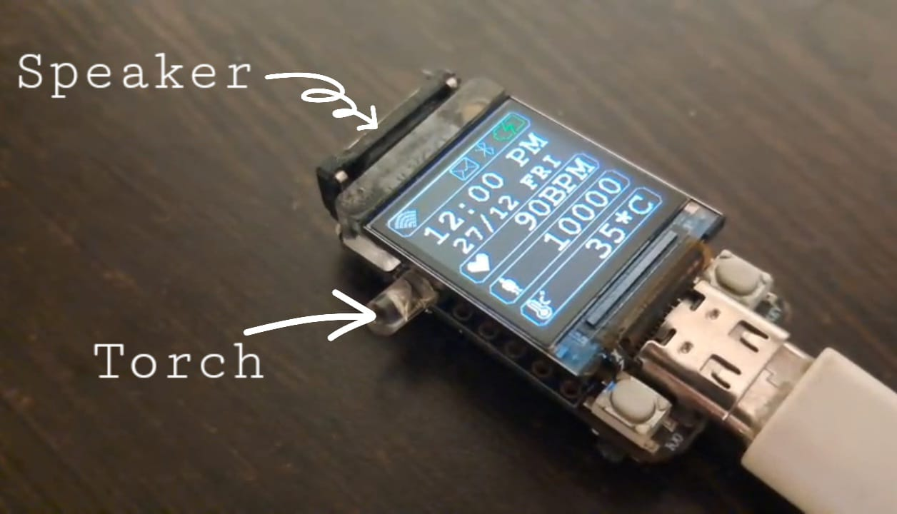
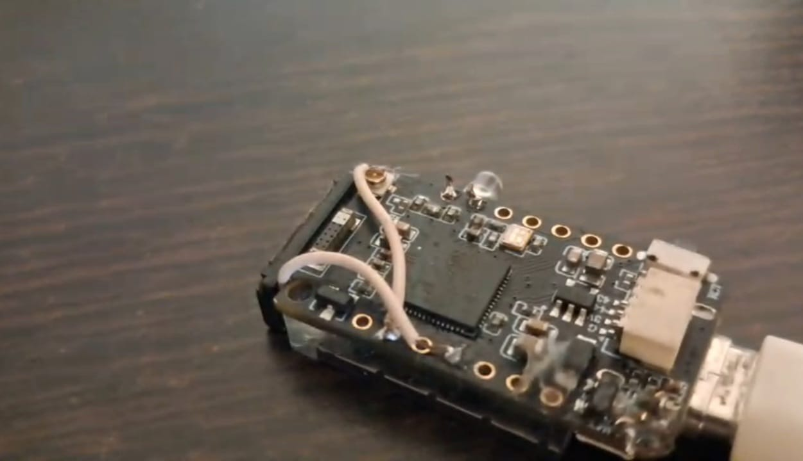
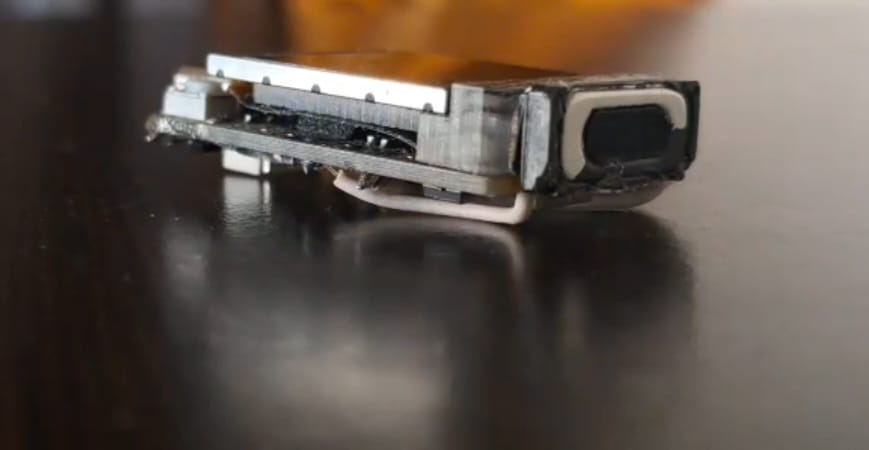

## Requirements
1. LILYGO TQT Pro
2. USB-C cable
3. 3mm LED (White colour)
4. Small speaker (earpiece speaker from Redmi 1s)
5. MPU6050 accelerometer
6. Stemma qt connector
7. A computer with PlatformIO installed
8. LiPo battery
9. JST connector (optional)

## Hardware setup
1. Solder a white coloured LED to IO33 and 34 with the ground pin soldered on IO34
2. Solder a speaker to GND and IO16
3. Solder a JST connector (included in the TQT Pro's box) to the battery charge pads on the microcontroller or directly solder the battery to the pads
4. Solder a Stemma qt connector to the MPU6050
5. Connect the Stemma qt connector to the TQT Pro

!!! note 

    The accelerometer is not shown
