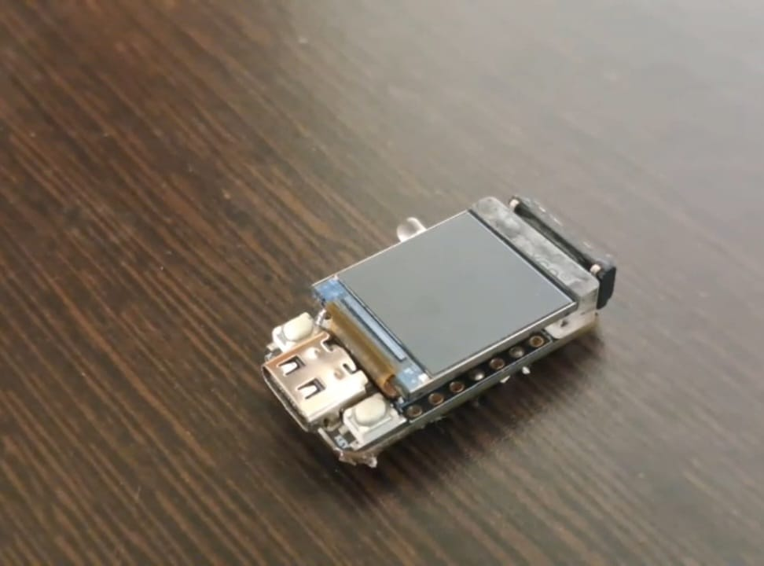
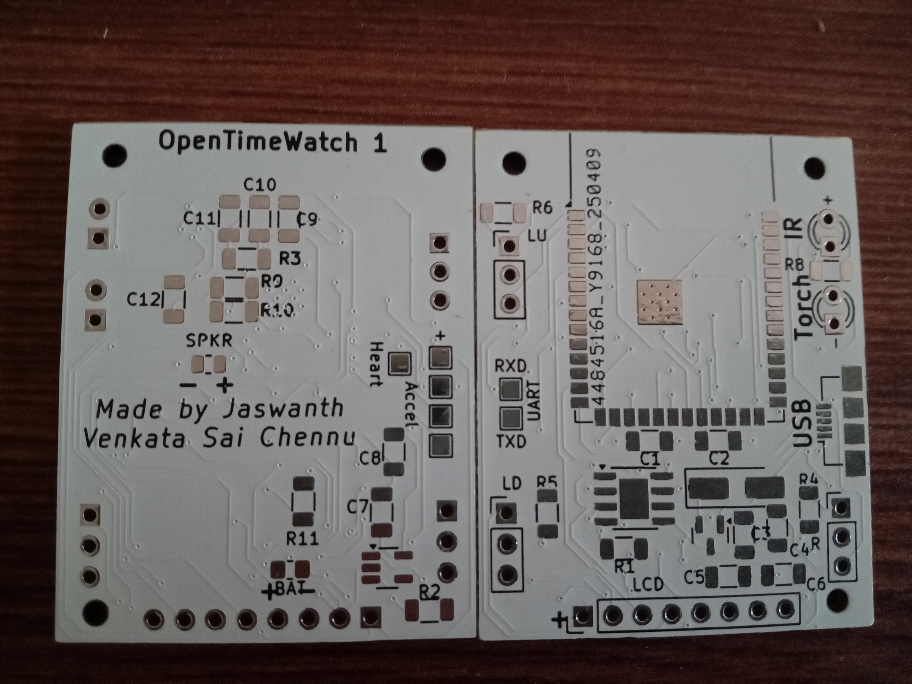

## LILYGO TQT Pro
1. Processor:- ESP32 S3
2. RAM:- 2MB
3. Flash:- 4MB/8MB
4. 2 Buttons
5. Torch
6. Speaker
7. 0.85" GC9107 128 x 128 IPS display
8. MPU6050
9. USB-C

Near EOL due lack of functionality compared to OpenTimeWatch 1 Rev 2.

## OpenTimeWatch 1 Rev 1
1. Processor:- ESP32 S3
2. RAM:- 8MB
3. Flash:- 16MB
4. 3 Buttons
5. Torch
6. Speaker
7. 1.44" 128 x 128 TFT display
8. IR transmitter
9. MPU6050
10. Pulse sensor
11. Micro USB-B

Superseded by OpenTimeWatch 1 Rev 2.

## OpenTimeWatch 1 Rev 2
1. Processor:- ESP32 S3
2. RAM:- 8MB
3. Flash:- 16MB
4. 3 Buttons
6. Speaker
7. 1.54" 128 x 128 TFT display
8. IR transmitter
9. MPU6050
10. BMP280
11. Micro USB-B

Still in development.
