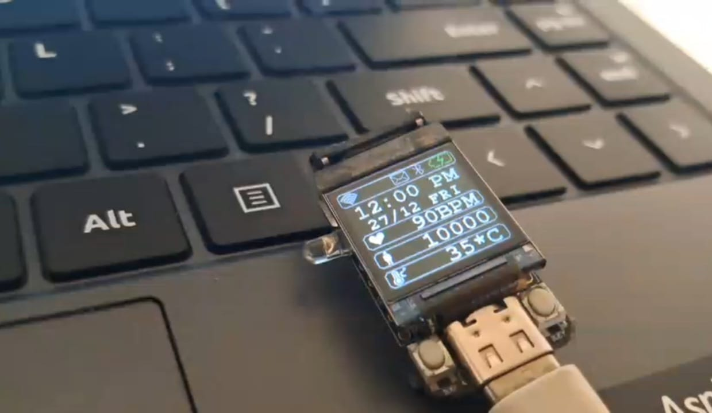
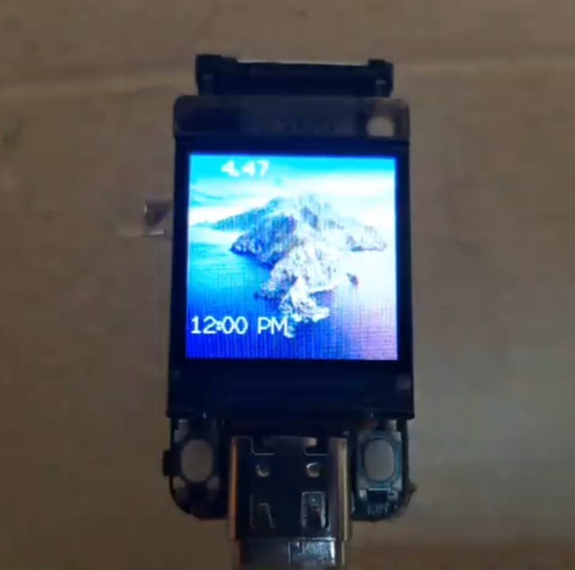

## V0.3.3
Release date :- 24 / 4 / 2025

This update adds the option to configure your hardware in the configurator tool.

What's new :

1. OpenTimeWatch Configurator tool can now configure board settings. 

## V0.3.2
Release date :- 19 / 4 / 2025

This update introduces OpenTimeWatch Configurator tool which allows users to set the WiFi and Time settings without manually changing it in the code.

What's new :

1. OpenTimeWatch Configurator tool.

## V0.3.1
Release date :- 15 / 2 / 2025

This update brings bug fixes and improved documentation.

Fixes :

1. otwUI bug fix.
2. Better support for TQT pro N8
3. Improved documentation.

## V0.3.0
Release date :- 10 / 1 / 2025

This update brings a fresh look for the watch and activity screen, lets you use more than one watch face, and adds WiFi to set the time accurately. We also improved the menus with a back option and made the code easier to manage.

What's new :

1. New watch face and activity view UI (made using [lopaka.app](https://lopaka.app/sandbox))
2. Multiple watch faces
3. WiFi support
4. Time support and synchronisation with WiFi
5. Back option in menus
6. MPU6050 support'
7. Apps and submenus are sperated from ```main.cpp```
8. New otwUI library for watch UI

New Watch face



Old Watch face



## V0.2.1
Release date :- 23 / 11 / 2024

Made quality of life improvements for OS navigation

Fixed : 

1. Better OS navigation

What's new :
1. Increased the pitch of the speaker demo
2. Added a manual for OS navigation

## V0.2.0
Release date :- 19 / 11 / 2024

This update introduces menus and a Settings screen to organize the watch's functions. You can now play a Pong game, see an Activity View, and use the watch to control peripherals like a speaker or torch.

What's new:

1. Menus
2. Pong Game
3. Support for peripherals (Torch and speaker support)
4. Settings menu
5. Activity View
6. Matrix Effect

## V0.1.0
The first alpha release of the OpenTimeWatch OS

What's new :

1. Static Watch Face
2. About Screen
3. Usage of the built in buttons to change the screen